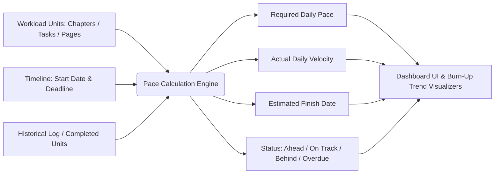

# Comprehensive Pace Management System Specification & Implementation Guide

> **A Complete Blueprint for Velocity Tracking, Burn-Up Trajectory Forecasting, Dynamic Deadline Management, and UI/UX Design**

---

## Table of Contents
1. [Introduction & Core Concept](#1-introduction--core-concept)
2. [How Pace Management Works (Workflow & Math)](#2-how-pace-management-works-workflow--math)
3. [Data Architecture & Schemas](#3-data-architecture--schemas)
4. [Mathematical Engine & Formulas](#4-mathematical-engine--formulas)
5. [Complete Color Palette & Design System](#5-complete-color-palette--design-system)
6. [UI Components & Layout Architecture](#6-ui-components--layout-architecture)
7. [Visualizations (Burn-Up & Candlestick Charts)](#7-visualizations-burn-up--candlestick-charts)
8. [Universal Code Implementation (Drop-In Ready)](#8-universal-code-implementation-drop-in-ready)
9. [Step-by-Step Guide for Implementing in Another Website](#9-step-by-step-guide-for-implementing-in-another-website)

---

## 1. Introduction & Core Concept

### What is Pace Management?
Standard progress trackers simply show: `(Completed Units / Total Units) * 100%`.
This is misleading because a user who is **50% done** might think they are doing well—even if their deadline is tomorrow!

**Pace Management** introduces **Time & Velocity**:
- It tracks **how fast you must work** to meet your deadline (`Required Pace`).
- It measures **how fast you are actually working** (`Actual Pace / Velocity`).
- It projects **when you will actually finish** if you continue at your current speed (`Estimated Finish Date`).
- It warns you before you fall behind, allowing you to calibrate daily workloads across projects, programs, or subjects.



---

## 2. How Pace Management Works (Workflow & Math)

### The 4 Timeline Scopes
1. **Global Master Pace Timeline**:
   - Covers the entire curriculum, course list, or product backlog from Day 1 to Final Deadline.
   - In simple mode, it requires only a **Start Date** and **Deadline** (no arbitrary name needed), automatically aggregating all items.
   - In custom mode, users can selectively toggle specific items or secondary timelines.

2. **Program-Based Pace Timeline**:
   - Bundles all subjects/modules under a single degree, course track, or client program.
   - Dynamically resolves all child modules inside that program.

3. **Subject-Based Pace Timeline**:
   - Focuses strictly on a single topic, book, or sprint.

4. **Bundle Pace Timeline**:
   - An arbitrary collection of items across different categories (e.g., "Physics + Organic Chemistry" or "Sprint 1 Critical Epics") bundled together under a unified start date and deadline.

---

## 3. Data Architecture & Schemas

### 3.1 Goal Schema (`PaceGoal`)

```typescript
export interface PaceGoal {
  id: string;                         // Unique UUID or timestamp (e.g. 'goal_1790962800')
  type: 'global' | 'program' | 'subject' | 'bundle'; // Target scope
  target: string;                     // Goal Name or Program / Subject Name
  startDate: string;                  // 'YYYY-MM-DD'
  deadline: string;                   // 'YYYY-MM-DD'
  subjects?: string[];                // Explicit array of subject IDs / names
  programs?: string[];                // Explicit array of program IDs / names
  secondaryPaces?: string[];          // IDs of linked child pace goals
  notes?: string;                     // Optional user notes
  createdAt?: string;                 // ISO Date string
}
```

### 3.2 Calculated Output Schema (`PaceStats`)

```typescript
export interface PaceStats {
  total: number;                      // Total chapters / workload units
  completed: number;                  // Completed units (supports fractions)
  remaining: number;                  // Math.max(0, total - completed)
  percentage: number;                 // Integer 0 - 100
  totalDays: number;                  // Total days in the goal window
  daysElapsed: number;                // Days since startDate (inclusive)
  daysRemaining: number;              // Days left until deadline
  reqPace: number;                    // Required units/day (e.g. 1.45)
  curPace: number;                    // Current velocity in units/day (e.g. 1.20)
  projectedFinish: string;            // Formatted date string (e.g. "14 Nov 2026")
  daysNeeded: number;                 // Days required at curPace
  isBehind: boolean;                  // True if curPace < reqPace
  status: 'finished' | 'on-track' | 'behind' | 'future' | 'overdue' | 'no-data';
  timeGoalCountdownStr: string;       // e.g. "42 Days Left" or "3 Days Overdue"
  finishDisplay: string;              // UI string e.g. "12 Dec 2026" or "Overdue"
  estDaysNeededStr: string;           // UI string e.g. "35 Days Needed"
  projectedDate: Date | null;         // Projected completion Date object
  targetedSubjects: Set<string>;      // Resolved names of included items
}
```

### 3.3 Global Pace Target Configuration

When setting up a **Global Overall Goal** (`type: 'global'`), the interface provides a dedicated two-part configuration:

1. **Part 1: All Subjects Inside Program Dropdowns**:
   - Each program is organized into an expandable accordion/dropdown with subject counts and toggle chevron.
   - Users can select subjects specifically on a subject-wise basis across any active program.
2. **Part 2: Secondary Paces**:
   - Users can link existing pace goals (bundles, program milestones, or subject goals) as secondary paces.
   - Linked timelines contribute their targeted scope into the overarching global pacing calculation.
3. **Flexible Setup**:
   - Global pace can be configured **subject-wise** (Part 1 only), via **secondary paces** (Part 2 only), or by **combining both** simultaneously. If neither is specified, the goal defaults to covering all active subjects in the curriculum.

---

## 4. Mathematical Engine & Formulas

Here are the exact equations used to compute the numbers on the cards and charts:

### 4.1 Time Deltas

```javascript
const MS_PER_DAY = 1000 * 60 * 60 * 24;

// Normalize dates to midnight to prevent timezone drift
const today = new Date(now);
today.setHours(0, 0, 0, 0);

const start = new Date(startDate);
start.setHours(0, 0, 0, 0);

const target = new Date(deadline);
target.setHours(0, 0, 0, 0);

// Total calendar span of the goal
const totalDays = Math.max(1, Math.ceil((target - start) / MS_PER_DAY));

// Number of days that have elapsed since the start (day 1 is 1)
const daysElapsed = Math.floor((today - start) / MS_PER_DAY) + 1;

// Days remaining until deadline
const daysRemaining = Math.max(0, Math.ceil((target - today) / MS_PER_DAY));
const diffDaysTarget = Math.ceil((target - today) / MS_PER_DAY);
```

### 4.2 Workload Quantities

```javascript
const remaining = Math.max(0, total - completed);
const percentage = total > 0 ? Math.min(100, Math.round((completed / total) * 100)) : 0;
```

### 4.3 Required Pace Formula (`reqPace`)

How many units per day must the user complete?

$$\text{reqPace} = \begin{cases} 
\frac{\text{Total}}{\text{Total Days}}, & \text{if } \text{Today} < \text{Start Date (Future)} \\
\text{Remaining}, & \text{if } \text{Today} > \text{Deadline (Overdue)} \\
\frac{\text{Remaining}}{\max(1, \text{Days Remaining})}, & \text{if } \text{Start Date} \le \text{Today} \le \text{Deadline}
\end{cases}$$

```javascript
let reqPaceVal = 0;
if (total > 0 && remaining > 0) {
    if (today < start) {
        reqPaceVal = total / totalDays;
    } else if (today > target) {
        reqPaceVal = remaining;
    } else {
        reqPaceVal = remaining / Math.max(1, daysRemaining);
    }
}
```

### 4.4 Actual Pace / Velocity Formula (`curPace`)

What has been the user's average output per day since the start date?

$$\text{curPace} = \frac{\text{Completed Units}}{\max(1, \text{Days Elapsed})}$$

```javascript
let curPaceVal = 0;
if (total > 0 && today >= start) {
    curPaceVal = completed / Math.max(1, daysElapsed);
}
```

### 4.5 Estimated Finish Date Projection

If the user continues at their current velocity (`curPace`), when will all remaining units be finished?

$$\text{Days Needed} = \left\lceil \frac{\text{Remaining}}{\text{curPace}} \right\rceil$$
$$\text{Projected Finish Date} = \text{Today} + \text{Days Needed}$$

```javascript
let daysNeeded = 0;
let projectedDate = new Date(today);

if (curPaceVal > 0 && remaining > 0) {
    daysNeeded = Math.ceil(remaining / curPaceVal);
    projectedDate.setDate(today.getDate() + daysNeeded);
}
```

### 4.6 Status Classification Rules

| Status | Condition | Meaning & UI Feedback |
| :--- | :--- | :--- |
| **`finished`** | `remaining <= 0` | Goal achieved! Green badge "Finished". |
| **`on-track`** | `curPace >= reqPace` & `today <= target` | Speed is sufficient to finish on or before deadline. |
| **`behind`** | `curPace < reqPace` & `today <= target` | Speed is too slow. Red/Orange alert. |
| **`overdue`** | `today > target` & `remaining > 0` | Deadline passed without completion. Rose/Red alert. |
| **`future`** | `today < start` | Goal hasn't started yet. Blue badge "Future". |
| **`no-data`** | `curPace === 0` & `total > 0` | User has not logged any work yet. |

---

## 5. Complete Color Palette & Design System

Every color in Pace Management is chosen for high contrast, immediate clarity, and dark/light harmony.

### 5.1 Color Tokens & Semantic Values

| Semantic Role | Color Name | Hex Code | Tailwind Light | Tailwind Dark | Meaning / Application |
| :--- | :--- | :--- | :--- | :--- | :--- |
| **Pace Theme Primary** | Orange 500 | `#f97316` | `bg-orange-500` | `bg-orange-500` | Primary buttons, active tabs, header icon |
| **Pace Theme Secondary**| Amber 500 | `#f59e0b` | `bg-amber-500` | `bg-amber-500` | Gradient endpoints, secondary accents |
| **On Track / Ahead** | Emerald 500 | `#10b981` | `text-emerald-600` | `text-emerald-400` | Good velocity, completed milestones, badges |
| **On Track Surface** | Emerald 50 | `#ecfdf5` | `bg-emerald-50` | `bg-emerald-950/40`| Emerald status badge background |
| **Behind / Warning** | Orange 600 | `#ea580c` | `text-orange-600` | `text-orange-400` | Behind required speed, warning badges |
| **Behind Surface** | Orange 50 | `#fff7ed` | `bg-orange-50` | `bg-orange-950/40` | Warning pill background, required pace card |
| **Overdue / Critical**| Red 500 | `#ef4444` | `text-red-600` | `text-red-400` | Overdue deadline, critical deficit |
| **Overdue Surface** | Red 50 | `#fef2f2` | `bg-red-50` | `bg-red-950/40` | Overdue pill background |
| **Forecast / Trajectory**| Indigo 500 | `#6366f1` | `text-indigo-600` | `text-indigo-400` | Projected finish card, trend charts |
| **Forecast Surface** | Indigo 50 | `#eef2ff` | `bg-indigo-50` | `bg-indigo-900/20` | Forecast KPI background, modal cards |
| **Timeline Dates** | Blue 500 | `#3b82f6` | `text-blue-500` | `text-blue-400` | Countdown pill ("42 Days Left") |
| **Card Shell (Light)** | Pure White | `#ffffff` | `bg-white` | - | Primary background for cards |
| **Card Shell (Dark)** | Slate 800 | `#1e293b` | - | `dark:bg-slate-800`| Dark mode background for cards |
| **Surface Inner (Light)**| Slate 50 | `#f8fafc` | `bg-slate-50` | - | Form section / inner container background |
| **Surface Inner (Dark)** | Slate 900 | `#0f172a` | - | `dark:bg-slate-900`| Dark mode inner container background |
| **Border (Light)** | Slate 200 | `#e2e8f0` | `border-slate-200` | - | Card dividers and outer outlines |
| **Border (Dark)** | Slate 700 | `#334155` | - | `dark:border-slate-700`| Dark mode borders and outlines |

### 5.2 Dynamic Progress Bar Gradients

Depending on whether a goal is on track or behind, the progress bar dynamically swaps its gradient:

- **On Track Gradient**:
  ```css
  background: linear-gradient(to right, #6366f1, #10b981); /* Indigo-500 to Emerald-500 */
  ```
- **Behind Gradient**:
  ```css
  background: linear-gradient(to right, #f97316, #ef4444); /* Orange-500 to Red-500 */
  ```

---

## 6. UI Components & Layout Architecture

The Pace Management interface consists of 3 primary visual sections:

```
+-----------------------------------------------------------------------------------+
| SECTION 1: GLOBAL KPI CARDS BANNER (3 Cards Grid)                                 |
| [ Required Pace (To Hit Target) ]    [ My Actual Pace ]    [ Est. Finish Date ]   |
+-----------------------------------------------------------------------------------+
| SECTION 2: ADD PACE GOAL FORM                                                     |
| [ Bundle Type ]  [ Goal Name ]  [ Start Date ]  [ Deadline ]                      |
| [ Collapsible Items Checklist: Subjects / Programs with Passed Statuses ]         |
| [ [CREATE PACE TARGET BUTTON] ]                                                   |
+-----------------------------------------------------------------------------------+
| SECTION 3: ACTIVE TIMELINES GRID (Responsive Cards)                               |
| +-------------------------+ +-------------------------+ +-------------------------+ |
| | Goal Card 1             | | Goal Card 2             | | Goal Card 3             | |
| | - Title & Status Badge  | | - Title & Status Badge  | | - Title & Status Badge  | |
| | - Dates & Countdown     | | - Dates & Countdown     | | - Dates & Countdown     | |
| | - Dual Progress Bar     | | - Dual Progress Bar     | | - Dual Progress Bar     | |
| | - Velocity vs Required  | | - Velocity vs Required  | | - Velocity vs Required  | |
| | - Action Buttons        | | - Action Buttons        | | - Action Buttons        | |
| +-------------------------+ +-------------------------+ +-------------------------+ |
+-----------------------------------------------------------------------------------+
```

### 6.1 Top KPI Stat Cards (HTML Blueprint)

```html
<div class="grid grid-cols-1 md:grid-cols-3 gap-3 sm:gap-4 md:gap-6 mb-8">
  
  <!-- Card 1: Required Daily Pace (To Hit Target) -->
  <div class="bg-white dark:bg-slate-800 p-5 rounded-2xl border border-slate-200/60 dark:border-slate-700/60 shadow-sm flex flex-col justify-between hover:-translate-y-1 transition-transform">
    <div>
      <span class="text-[9px] font-black text-slate-400 uppercase tracking-widest">Daily Required</span>
      <h3 class="text-xl font-black mt-1 dark:text-white">To Hit Target</h3>
    </div>
    <div class="mt-4">
      <div id="target-req-pace" class="text-3xl font-black text-orange-500">1.85</div>
      <div class="flex items-center justify-between mt-1 text-[9px] font-bold">
        <span class="text-slate-400 uppercase tracking-wider">To hit deadline</span>
        <span class="text-blue-500 font-black">42 Days Left</span>
      </div>
    </div>
  </div>

  <!-- Card 2: Actual Pace (My Actual Pace) -->
  <div class="bg-white dark:bg-slate-800 p-5 rounded-2xl border border-slate-200/60 dark:border-slate-700/60 shadow-sm flex flex-col justify-between hover:-translate-y-1 transition-transform">
    <div>
      <span class="text-[9px] font-black text-slate-400 uppercase tracking-widest">Current Performance</span>
      <h3 class="text-xl font-black mt-1 dark:text-white">My Actual Pace</h3>
    </div>
    <div class="mt-4">
      <div id="current-pace-stat" class="text-3xl font-black dark:text-white">1.20</div>
      <div class="flex items-center justify-between mt-1 text-[9px] font-bold">
        <span class="text-slate-400 uppercase tracking-wider">My current speed</span>
        <span class="text-emerald-500 font-black">48 Days Passed</span>
      </div>
    </div>
  </div>

  <!-- Card 3: Forecast Finish -->
  <div class="bg-indigo-50 dark:bg-indigo-900/20 p-5 rounded-2xl border border-indigo-100 dark:border-indigo-800/50 shadow-sm flex flex-col justify-between hover:-translate-y-1 transition-transform relative group">
    <div>
      <span class="text-[9px] font-black text-indigo-400 uppercase tracking-widest">Trend Forecast</span>
      <h3 class="text-xl font-black mt-1 text-indigo-950 dark:text-indigo-100">Est. Finish</h3>
    </div>
    <div class="mt-4">
      <div id="projected-finish" class="text-2xl font-black text-indigo-600 dark:text-indigo-400">14 Dec 2026</div>
      <div class="flex items-center justify-between mt-1 text-[9px] font-bold">
        <span class="text-indigo-400/80 uppercase tracking-wider">Based on my current speed</span>
        <span class="text-orange-500 font-black">62 Days Needed</span>
      </div>
    </div>
  </div>
</div>
```

### 6.2 Active Timeline Card (HTML Blueprint)

```html
<div class="bg-[#131b2e] p-5 sm:p-6 rounded-3xl border border-slate-700/60 shadow-lg flex flex-col justify-between relative group hover:border-slate-600 transition-all">
  
  <!-- Header: Dot, Scope Label & Action Buttons -->
  <div>
    <div class="flex justify-between items-center mb-1">
      <div class="flex items-center">
        <span class="inline-block w-2.5 h-2.5 rounded-full bg-orange-500 mr-2"></span>
        <span class="text-[10px] md:text-[11px] font-black uppercase tracking-wider text-slate-400">BUNDLE GOAL</span>
      </div>
      <div class="flex items-center space-x-1">
        <!-- Action Buttons -->
        <button class="p-1.5 text-slate-400 hover:text-indigo-400 hover:bg-slate-800 rounded-lg transition-all" title="Burn-up Trajectory">
          <svg class="w-3.5 h-3.5" fill="none" stroke="currentColor" viewBox="0 0 24 24"><path stroke-linecap="round" stroke-linejoin="round" stroke-width="2" d="M7 12l3-3 3 3 4-4M8 21l4-4 4 4M3 4h18M4 4h16v12a1 1 0 01-1 1H5a1 1 0 01-1-1V4z"/></svg>
        </button>
        <button class="p-1.5 text-slate-400 hover:text-amber-400 hover:bg-slate-800 rounded-lg transition-all" title="Candlestick Chart">
          <svg class="w-3.5 h-3.5" fill="none" stroke="currentColor" viewBox="0 0 24 24"><path stroke-linecap="round" stroke-linejoin="round" stroke-width="2" d="M9 19v-6a2 2 0 00-2-2H5a2 2 0 00-2 2v6a2 2 0 002 2h2a2 2 0 002-2zm0 0V9a2 2 0 012-2h2a2 2 0 012 2v10m-6 0a2 2 0 002 2h2a2 2 0 002-2m0 0V5a2 2 0 012-2h2a2 2 0 012 2v14a2 2 0 01-2 2h-2a2 2 0 01-2-2z"/></svg>
        </button>
        <button class="p-1.5 text-slate-400 hover:text-emerald-400 hover:bg-slate-800 rounded-lg transition-all" title="Details">
          <svg class="w-3.5 h-3.5" fill="none" stroke="currentColor" viewBox="0 0 24 24"><path stroke-linecap="round" stroke-linejoin="round" stroke-width="2" d="M15 12a3 3 0 11-6 0 3 3 0 016 0z"/><path stroke-linecap="round" stroke-linejoin="round" stroke-width="2" d="M2.458 12C3.732 7.943 7.523 5 12 5c4.478 0 8.268 2.943 9.542 7-1.274 4.057-5.064 7-9.542 7-4.477 0-8.268-2.943-9.542-7z"/></svg>
        </button>
        <button class="p-1.5 text-slate-400 hover:text-blue-400 hover:bg-slate-800 rounded-lg transition-all" title="Edit">
          <svg class="w-3.5 h-3.5" fill="none" stroke="currentColor" viewBox="0 0 24 24"><path stroke-linecap="round" stroke-linejoin="round" stroke-width="2" d="M15.232 5.232l3.536 3.536m-2.036-5.036a2.5 2.5 0 113.536 3.536L6.5 21.036H3v-3.572L16.732 3.732z"/></svg>
        </button>
        <button class="p-1.5 text-slate-400 hover:text-red-400 hover:bg-slate-800 rounded-lg transition-all" title="Delete">
          <svg class="w-3.5 h-3.5" fill="none" stroke="currentColor" viewBox="0 0 24 24"><path stroke-linecap="round" stroke-linejoin="round" stroke-width="2" d="M19 7l-.867 12.142A2 2 0 0116.138 21H7.862a2 2 0 01-1.995-1.858L5 7m5 4v6m4-6v6m1-10V4a1 1 0 00-1-1h-4a1 1 0 00-1 1v3M4 7h16"/></svg>
        </button>
      </div>
    </div>

    <h4 class="font-black text-xl sm:text-2xl text-white truncate tracking-tight mt-2">Phase 1 Target</h4>
    <p class="text-xs font-bold text-slate-400 tracking-wider mt-1">
      Timeline: <span class="text-blue-400 font-bold">01 January 2026</span> - <span class="text-orange-400 font-bold">31 December 2026</span>
    </p>
    <p class="text-[11px] font-bold text-blue-400/90 truncate mt-1">Math, Data Structures, Physics</p>
  </div>

  <!-- Progress Bar & Redesigned Velocity / Required / Est Part -->
  <div class="mt-4 sm:mt-5">
    <div class="flex justify-between items-end mb-1.5 text-xs font-bold">
      <span class="text-slate-300 font-bold">45 / 100 Ch</span>
      <span class="text-slate-400 font-bold">45%</span>
    </div>
    
    <!-- Progress Bar -->
    <div class="w-full bg-[#1e293b] h-2.5 rounded-full overflow-hidden p-0.5 border border-slate-700/50 mb-4">
      <div class="h-full rounded-full transition-all duration-500 bg-gradient-to-r from-orange-500 to-amber-500" style="width: 45%;"></div>
    </div>

    <!-- 2-Tier Velocity / Required / Est Noticeable Section -->
    <div class="grid grid-cols-2 gap-3 mb-3">
      <!-- REQ PACE Box (Emerald on-track / Rose behind) -->
      <div class="p-3.5 sm:p-4 rounded-2xl border bg-[#0b2424] border-emerald-500/40 flex flex-col justify-between">
        <div>
          <span class="block text-[9px] md:text-[10px] font-black uppercase tracking-wider text-emerald-400">REQ PACE</span>
          <div class="text-xl sm:text-2xl font-black text-emerald-400 mt-1">1.80 <span class="text-[10px] sm:text-xs font-bold text-emerald-500/80">ch/d</span></div>
        </div>
        <div class="text-[9px] md:text-[10px] font-black uppercase tracking-wider text-emerald-400 mt-2.5 sm:mt-3">42 DAYS LEFT</div>
      </div>

      <!-- CUR PACE Box -->
      <div class="p-3.5 sm:p-4 rounded-2xl border border-slate-700/60 bg-[#162033] flex flex-col justify-between">
        <div>
          <span class="block text-[9px] md:text-[10px] font-black uppercase tracking-wider text-slate-400">CUR PACE</span>
          <div class="text-xl sm:text-2xl font-black text-white mt-1">1.25 <span class="text-[10px] sm:text-xs font-bold text-slate-400">ch/d</span></div>
        </div>
        <div class="text-[9px] md:text-[10px] font-black uppercase tracking-wider text-emerald-400 mt-2.5 sm:mt-3">48 DAYS PASSED</div>
      </div>
    </div>

    <!-- EST. FINISH Box (Full Width) -->
    <div class="p-3.5 sm:p-4 rounded-2xl border border-slate-700/60 bg-[#162033] flex items-center justify-between">
      <div>
        <span class="block text-[9px] md:text-[10px] font-black uppercase tracking-wider text-slate-400">EST. FINISH</span>
        <span class="block text-[11px] sm:text-xs font-black text-amber-500 mt-0.5">44 Days Needed</span>
      </div>
      <div class="text-sm sm:text-base font-black text-white text-right">14 December 2026</div>
    </div>
  </div>
</div>
```

---

## 7. Visualizations (Burn-Up & Candlestick Charts)

### 7.1 Burn-Up Trajectory Chart (Using Chart.js)

The Burn-Up chart plots:
1. **Required Trajectory (Blue/Indigo)**: Diagonal straight line from (Start Date, 0 Units) to (Deadline, Total Units).
2. **Actual Progress (Emerald Line + Area Fill)**: Cumulative completed units plotted day-by-day up to today.
3. **Projected Trajectory (Amber Dashed Line)**: Extrapolates from today's actual completed units using `curPace` until it reaches `Total Units`.

```javascript
// Dataset Construction Function
function buildPaceChartDatasets({ total, completed, startDate, deadline, curPace }) {
    const labels = [];
    const reqData = [];
    const actData = [];
    const estData = [];

    const start = new Date(startDate);
    const end = new Date(deadline);
    const today = new Date();
    today.setHours(0,0,0,0);

    const totalDays = Math.max(1, Math.ceil((end - start) / (1000 * 60 * 60 * 24)));
    const reqPacePerDay = total / totalDays;

    let curr = new Date(start);
    while (curr <= end) {
        labels.push(curr.toLocaleDateString('en-GB', { day: 'numeric', month: 'short' }));
        
        // Required Pace line (steady diagonal)
        const daysElapsed = Math.max(0, Math.floor((curr - start) / (1000 * 60 * 60 * 24)));
        reqData.push(Math.min(total, Math.round(daysElapsed * reqPacePerDay)));

        // Actual Pace line (only plotted up to today)
        if (curr <= today) {
            actData.push(Math.min(total, Math.round((daysElapsed / totalDays) * completed)));
            if (curr.getTime() === today.getTime()) {
                estData.push(actData[actData.length - 1]);
            } else {
                estData.push(null);
            }
        } else {
            actData.push(null);
            // Extrapolate estimated trajectory
            const daysSinceToday = Math.floor((curr - today) / (1000 * 60 * 60 * 24));
            const projectedVal = completed + (daysSinceToday * curPace);
            estData.push(Math.min(total, Math.round(projectedVal)));
        }

        curr.setDate(curr.getDate() + Math.max(1, Math.round(totalDays / 15))); // sample 15 points
    }

    return { labels, reqData, actData, estData };
}
```

### 7.2 Candlestick Velocity Chart

A candlestick chart displays whether your study speed **accelerated (Bullish / Green)** or **decelerated (Bearish / Red)** across time intervals (e.g. 3-day or 7-day chunks):
- **Open**: Average velocity at the start of the interval.
- **Close**: Average velocity at the end of the interval.
- **High**: Peak single-day pace reached during that interval.
- **Low**: Lowest pace recorded during that interval.
- **Color rule**: If `Close >= Open` $\rightarrow$ `#10b981` (Green/Emerald). If `Close < Open` $\rightarrow$ `#ef4444` (Red/Rose).

---

## 8. Universal Code Implementation (Drop-In Ready)

Here is a pure, zero-dependency JavaScript module `PaceEngine.js` that you can copy directly into any project:

```javascript
/**
 * PaceEngine.js - Universal Pace Calculation Engine
 * Works in Node.js, Next.js, React, Vue, or Vanilla Browser JS.
 */
class PaceEngine {
    static MS_PER_DAY = 1000 * 60 * 60 * 24;

    /**
     * Compute full statistics for any workload goal.
     * @param {Object} goal - { startDate, deadline, totalUnits, completedUnits }
     * @param {Date} [referenceDate=new Date()]
     * @returns {Object} PaceStats
     */
    static calculateStats(goal, referenceDate = new Date()) {
        const today = new Date(referenceDate);
        today.setHours(0, 0, 0, 0);

        const start = new Date(goal.startDate);
        start.setHours(0, 0, 0, 0);

        const target = new Date(goal.deadline);
        target.setHours(0, 0, 0, 0);

        const total = Math.max(0, Number(goal.totalUnits) || 0);
        const completed = Math.max(0, Math.min(total, Number(goal.completedUnits) || 0));
        const remaining = Math.max(0, total - completed);
        const percentage = total > 0 ? Math.round((completed / total) * 100) : 0;

        const totalDays = Math.max(1, Math.ceil((target - start) / this.MS_PER_DAY));
        const daysElapsed = Math.floor((today - start) / this.MS_PER_DAY) + 1;
        const daysRemaining = Math.max(0, Math.ceil((target - today) / this.MS_PER_DAY));
        const diffDaysTarget = Math.ceil((target - today) / this.MS_PER_DAY);

        let reqPaceVal = 0;
        let curPaceVal = 0;

        if (total > 0 && remaining > 0) {
            if (today < start) {
                reqPaceVal = total / totalDays;
                curPaceVal = 0;
            } else if (today > target) {
                reqPaceVal = remaining;
                curPaceVal = completed / Math.max(1, daysElapsed);
            } else {
                reqPaceVal = remaining / Math.max(1, daysRemaining);
                curPaceVal = completed / Math.max(1, daysElapsed);
            }
        } else if (total > 0 && remaining === 0) {
            curPaceVal = completed / Math.max(1, daysElapsed);
        }

        const reqPace = Math.round(reqPaceVal * 100) / 100;
        const curPace = Math.round(curPaceVal * 100) / 100;

        // Status Determination
        let status = 'no-data';
        let finishDisplay = '--';
        let daysNeeded = 0;
        let projectedDate = new Date(today);

        if (total === 0) {
            status = 'no-data';
            finishDisplay = 'No Target';
        } else if (remaining === 0) {
            status = 'finished';
            finishDisplay = 'Finished';
        } else if (curPaceVal <= 0) {
            if (today < start) {
                status = 'future';
                finishDisplay = 'Future';
            } else if (today > target) {
                status = 'overdue';
                finishDisplay = 'Overdue';
            } else {
                status = 'no-data';
                finishDisplay = 'No Activity';
            }
        } else {
            daysNeeded = Math.ceil(remaining / curPaceVal);
            projectedDate.setDate(today.getDate() + daysNeeded);
            finishDisplay = projectedDate.toLocaleDateString('en-GB', { day: '2-digit', month: 'short', year: 'numeric' });

            if (today > target) {
                status = 'overdue';
            } else if (curPace >= reqPace) {
                status = 'on-track';
            } else {
                status = 'behind';
            }
        }

        const isBehind = status === 'behind' || status === 'overdue';

        return {
            total,
            completed,
            remaining,
            percentage,
            totalDays,
            daysElapsed,
            daysRemaining,
            reqPace,
            curPace,
            daysNeeded,
            projectedDate,
            finishDisplay,
            isBehind,
            status,
            countdownText: diffDaysTarget > 0 ? `${diffDaysTarget} Days Left` : (diffDaysTarget === 0 ? 'Due Today' : `${Math.abs(diffDaysTarget)} Days Overdue`)
        };
    }
}

if (typeof module !== 'undefined' && module.exports) {
    module.exports = PaceEngine;
}
```

---

## 9. Step-by-Step Guide for Implementing in Another Website

Follow this checklist to add Pace Management to any application:

### Step 1: Define Your Workload Units
Determine what constitutes a "unit" of work in your domain:
- **Education / Learning Apps**: Chapters, lectures, exercises, pages read.
- **Project Management / Jira**: Story points, issues, tickets, sub-tasks.
- **Fitness / Habit Trackers**: Workouts completed, kilometers run, calories burned.
- **Sales / Finance**: Closed deals, quotas hit, revenue milestones.

### Step 2: Set Up Database / State Model
Add a collection or table `pace_goals`:
```json
{
  "id": "goal_01",
  "type": "bundle",
  "target": "Midterm Exam Bundle",
  "startDate": "2026-09-01",
  "deadline": "2026-11-15",
  "subjects": ["Algebra", "Physics"]
}
```

### Step 3: Integrate `PaceEngine.calculateStats()`
Whenever a user marks a task or chapter as complete, run `PaceEngine.calculateStats(goal)`.

### Step 4: Render UI Cards
Use the Tailwind classes or CSS variables provided in [Section 5](#5-complete-color-palette--design-system) and [Section 6](#6-ui-components--layout-architecture) to render the cards with dynamic gradients:
```javascript
const stats = PaceEngine.calculateStats(goal);
const isBehind = stats.isBehind;

cardElement.innerHTML = `
  <div class="progress-bar ${isBehind ? 'from-orange-500 to-red-500' : 'from-indigo-500 to-emerald-500'}" style="width: ${stats.percentage}%"></div>
  <div class="velocity-box">${stats.curPace} / Day</div>
  <div class="required-box">${stats.reqPace} / Day</div>
  <div class="projected-finish">Finish: ${stats.finishDisplay}</div>
`;
```

### Step 5: (Optional) Mount Chart.js for Trajectory Visualizer
Embed a `<canvas>` element and call `buildPaceChartDatasets()` from Section 7 to render the interactive burn-up chart modal.

---

*Authored for the X-29 Codebase & Reusable Across Any Web Platform.*
