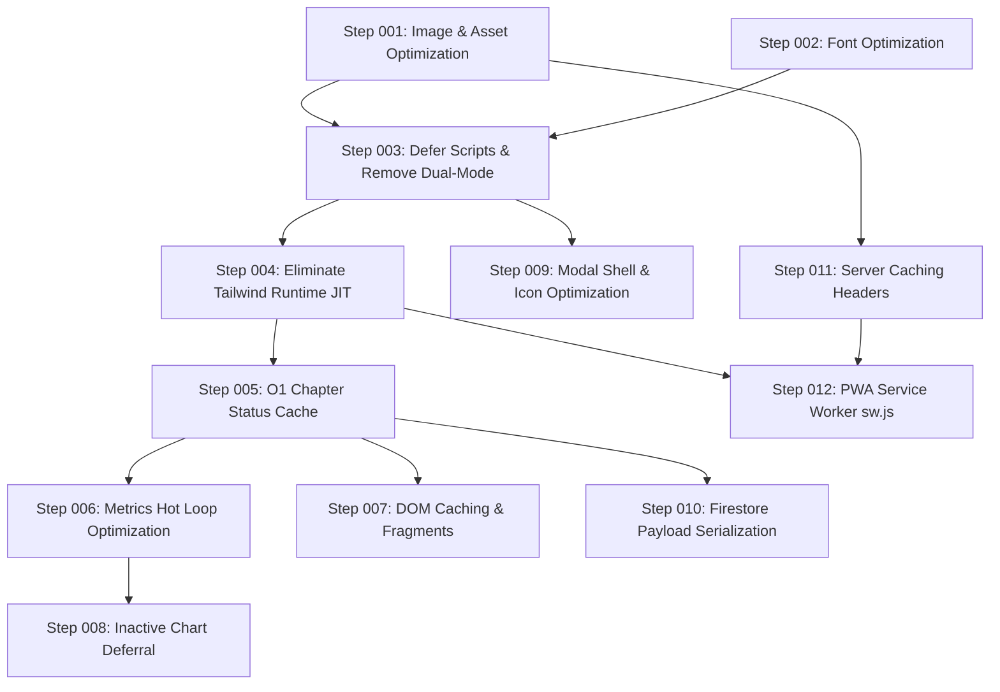

# X-29 — ULTRA PERFORMANCE MASTER PLAN & ROADMAP

**Version:** 1.0.0  
**Date:** 2026-09-30  
**Mission:** Transform X-29 into a light-speed, ultra-responsive, premium web application with 0 visual changes, 0 feature changes, 0 logic changes, and 100% preservation of existing technologies and behaviors.

---

## 1. CURRENT TECHNOLOGY STACK

* **Core Language:** Vanilla JavaScript (ES6+ with standard CommonJS/Global interoperability for automated tests).
* **Markup:** Semantic HTML5 SPA Shell (`index.html`) + Modular page fragments (`pages/*/*.html`).
* **Styling:** Vanilla CSS design systems (`css/style.css`, `pages/*/*.css`) combined with Tailwind CSS utility classes.
* **Charts & Visualizations:** Chart.js v4+ (via CDN/local integration).
* **Database & Cloud Backend:** Google Firebase v12 Compat (`firebase-app`, `firebase-auth`, `firebase-firestore`).
* **Authentication:** Firebase Client Authentication with strict admin email verification guard (`ris2k29@gmail.com`).
* **Runtime / Local Server:** Node.js HTTP dev-server (`js/dev-server.js`) on port 3000.
* **Production Deployment:** Vercel static hosting (`vercel.json`).
* **Test Architecture:** Node.js Native Unit & Integration Test Suites (12 suites, 57 regression checkpoints).

---

## 2. CURRENT ARCHITECTURE SUMMARY

The application operates as a high-density, multi-track execution, scheduling, habit tracking, and analytics dashboard.
1. **Application Lifecycle:** Entry point is `js/core/app.js` (orchestrating state migration, Firebase authentication, Firestore subscription, and initial Dashboard mount).
2. **State Management:** Single global source of truth centered on `window.AppState` and synchronized to Firestore collection `/users/{uid}`.
3. **Routing System:** Internal Vanilla JS router (`router/router.js`) managing 11 routes (`dashboard`, `spectra-analytics`, `timer`, `daily-actions`, `schedule`, `subjects`, `paces-management`, `master-config`, `outcome`, `exam`, `monthly-target-setup`) using DOM container visibility switching with zero URL reload or browser pushState.
4. **Rendering Strategy:** Dynamic DOM template rendering and Chart.js canvas graphing triggered on state changes and route navigation.

---

## 3. CURRENT PERFORMANCE BASELINE SUMMARY

* **HTML Shell Size:** 617,052 bytes (7,839 lines, 3,171 DOM elements).
* **Active Project JavaScript Size:** 3,178,750 bytes (3.03 MB across 42,810 lines).
* **Active CSS Size:** 54,939 bytes (53.7 KB across 13 stylesheets).
* **Cold Shell HTTP Requests:** 55+ synchronous `<script>` requests + 13 stylesheets + 5 external CDNs + fonts.
* **Asset Weight:** `icons/logo-sticker.png` is 656.4 KB (uncompressed icon asset).
* **Client-Side Runtime Cost:** Runtime Tailwind JIT compiler parses 7,839 DOM lines client-side on startup.
* **DOM Query Cost:** 1,750 static DOM queries across modules with frequent lookups inside rendering loops.
* **Hot Loop Calculation:** `getChapterStatus` requires 28 ms per 300 calls via linear array scans over 365 task days.

---

## 4. DETECTED BOTTLENECK ANALYSIS

### Bottleneck A: Render-Blocking Head Execution
* **Phenomenon:** 55 JavaScript files and 13 stylesheets are synchronously linked in `<head>` without `defer` or `async`.
* **Impact:** The browser parser stops HTML parsing for every single script tag, resulting in high Time to First Paint (FCP) and prolonged blank screens.

### Bottleneck B: Client-Side JIT Tailwind Runtime
* **Phenomenon:** `<script src="https://cdn.tailwindcss.com"></script>` downloads and runs an in-browser CSS compiler.
* **Impact:** The script traverses the entire 7,839-line DOM tree, extracts class tokens, compiles CSS rules, and injects `<style>` blocks into `<head>` at runtime, locking the main thread during initial startup.

### Bottleneck C: Duplicate Script Evaluation
* **Phenomenon:** `state.js`, `auth.js`, `firebase.js`, `timerService.js`, `router.js`, `dashboard.js`, and `rollover.js` are loaded as standard `<script>` tags in `<head>`, and then re-imported as ES Modules inside `js/core/app.js`.
* **Impact:** Redundant script parsing and memory allocation on browser startup.

### Bottleneck D: Oversized Unoptimized Image Asset
* **Phenomenon:** `icons/logo-sticker.png` is 656.4 KB (2000x2000px raw image) displayed at 24px in the sidebar and 112px in the loading screen.
* **Impact:** 656 KB of network bandwidth and memory decoding wasted on a small UI icon.

### Bottleneck E: Un-memoized Hot Path Lookups in Task Engine
* **Phenomenon:** `TaskEngine.getChapterStatus` and `TaskEngine.isChapterCompleted` scan linearly through `AppState.tasks` (up to 365 days of tasks) and target databases on every invocation.
* **Impact:** During full dashboard and subject renders, thousands of linear scans occur, consuming CPU and causing perceptible stuttering.

### Bottleneck F: DOM Lookup Thrashing in Target Modules
* **Phenomenon:** `monthlyTargets.js` executes 230 DOM lookups (`getElementById`, `querySelector`, `querySelectorAll`), and `monthly target setup.js` executes 198 DOM lookups without caching references.
* **Impact:** Unnecessary DOM tree walks inside rendering loops triggering layout recalculations.

### Bottleneck G: Monolithic Firestore State Serialization
* **Phenomenon:** Every auto-save calls `JSON.stringify(AppState)` across the entire task history and targets databases.
* **Impact:** Synchronous JSON serialization blocks the UI thread during frequent background sync operations.

### Bottleneck H: Absence of Static Asset Caching & Service Worker
* **Phenomenon:** `js/dev-server.js` enforces `no-cache, no-store`, `vercel.json` defines no cache headers, and `sw.js` is absent despite PWA manifest presence.
* **Impact:** Zero repeat-view caching; all assets re-requested or revalidated over the network.

---

## 5. ROOT-CAUSE ANALYSIS

1. **Evolutionary Architecture:** The project originated as a monolithic single-file system (`js/script.js` was 20,683 lines and `index.html` was 285KB). In Phase 2, JavaScript was successfully decomposed into modules, but all module tags were accumulated in the HTML head.
2. **Prototyping Dependencies:** Tailwind Play CDN was originally introduced for rapid prototyping and never replaced with pre-compiled static CSS.
3. **Linear Data Structures:** `AppState.tasks` is an array of daily objects, which is natural for calendar display but computationally inefficient for O(1) status queries across subjects and chapters without a secondary index.

---

## 6. RISK ASSESSMENT

| Area | Risk Level | Mitigation Strategy |
| :--- | :--- | :--- |
| **UI / Styling Integrity** | High | Never alter existing classes, HTML markup, color tokens, or CSS rules. Compile or preserve exact Tailwind classes. |
| **Logic & Calculations** | High | Protect calculations with before-and-after snapshot tests; run all 12 test suites after each change. |
| **Event Handling** | Medium | Preserve existing global/window method attachments for inline handlers while using delegation for dynamic elements. |
| **Firebase Synchronization** | High | Retain existing data schemas, debounce timers, and cloud save triggers byte-for-byte. |
| **Navigation & Transition** | Medium | Maintain `_navSeq` synchronization and instant visibility toggle in `router/router.js`. |

---

## 7. OPTIMIZATION STRATEGY

1. **Phase 1: Zero-Risk Asset & Resource Loading (Steps 001 – 003)**
   - Optimize high-cost assets (PNG image payload).
   - Optimize font loading and preconnect resource hints.
   - Defer synchronous script loading and eliminate duplicate module executions.
2. **Phase 2: CSS & Rendering Engine Modernization (Step 004)**
   - Replace client-side JIT Tailwind compiler with pre-compiled static CSS containing identical classes.
3. **Phase 3: JavaScript hot Path & Memoization (Steps 005 – 006)**
   - Implement O(1) indexed caching for `getChapterStatus` and chapter lookups.
   - Optimize KPI calculation loops and debounced metric cascades.
4. **Phase 4: DOM Performance & List Rendering (Steps 007 – 008)**
   - Cache stable DOM element queries.
   - Batch DOM insertions with DocumentFragments.
   - Ensure lazy initialization of heavy chart instances on inactive tabs.
5. **Phase 5: State Serialization & Backend Optimization (Step 009 – 010)**
   - Optimize cloud save serialization payload.
   - Ensure background tasks do not block the main thread.
6. **Phase 6: Caching, Network & PWA Service Worker (Steps 011 – 012)**
   - Configure intelligent cache-control headers.
   - Implement lightweight Service Worker for static asset caching.

---

## 8. COMPLETE ORDERED STEP LIST

```text
Step ID: Step 001
Title: Lossless Image Compression & Optimal Sizing for Logo Asset
Priority: High (High Impact, Zero Risk)
Problem: icons/logo-sticker.png is 656.4 KB (2000x2000px uncompressed PNG) downloaded on every page load and rendered at 24px (sidebar) and 112px (loading overlay).
Root Cause: Raw oversized image asset deployed without web optimization or multi-resolution scaling.
Affected Area: Initial page load, network transfer, memory decoding.
Current Measurement: 672,115 bytes (656.4 KB).
Goal: Reduce asset size below 40 KB while maintaining pixel-perfect fidelity at target display sizes.
Proposed Solution: Generate an optimized web-ready PNG/WebP with sharp alpha channel matching the exact visual appearance of the logo sticker.
Why It Is Safe: Only changes image asset compression; no HTML, CSS, or JS behavior is touched.
Potential Risks: None if visual quality is strictly verified against original.
Files Likely Affected: icons/logo-sticker.png
Dependencies: None.
Validation Method: Visual inspection at 24px and 112px; file size verification.
Expected Performance Impact: 615+ KB reduction in cold network payload; faster image decode on mobile.
Status: COMPLETED
```

```text
Step ID: Step 002
Title: Font Loading & Resource Hint Optimization
Priority: High
Problem: Google Fonts stylesheet in <head> fetches 6 distinct font families (Inter, Outfit, Plus Jakarta Sans, JetBrains Mono, Rajdhani, Chakra Petch) with 20+ weights synchronously, causing render blocking.
Root Cause: Standard Google Fonts snippet loaded synchronously in head with full weight spectrum.
Affected Area: First Contentful Paint (FCP), font render waterfall.
Current Measurement: Synchronous Google Fonts stylesheet link blocking HTML parser.
Goal: Eliminate font render-blocking and ensure smooth font swap with zero layout shift (CLS: 0).
Proposed Solution: Ensure optimal preconnect to fonts.gstatic.com with crossorigin; audit font weights to load only actively used weights; verify font-display: swap.
Why It Is Safe: Visual typography remains 100% identical; no styles or font faces are changed.
Potential Risks: Flash of unstyled text if fallback fonts differ substantially.
Files Likely Affected: index.html, login.html
Dependencies: None.
Validation Method: Typography visual comparison; network waterfall inspection.
Expected Performance Impact: FCP improvement of 100-300ms on slower networks.
Status: COMPLETED
```

```text
Step ID: Step 003
Title: Defer Non-Critical Head Scripts & Eliminate Dual-Mode Execution
Priority: High
Problem: 55 script tags are synchronously loaded in <head>, blocking DOM parsing. Additionally, 7 core modules are loaded via script tags AND re-imported via app.js ES Module.
Root Cause: Historical migration left script tags in <head> while simultaneously bootstrapping via ES Module app.js.
Affected Area: HTML parsing, First Contentful Paint, DOMContentLoaded time.
Current Measurement: 55 synchronous blocking script tags in <head>; duplicate execution of 7 core modules.
Goal: Enable asynchronous/deferred parsing of scripts so HTML parser completes with zero blocking, and eliminate duplicate script evaluation.
Proposed Solution: Add defer attributes to scripts or cleanly harmonize ES Module dependency graph; preserve all global window assignments for inline HTML handlers.
Why It Is Safe: Scripts will still execute in exact order prior to DOMContentLoaded, and global window exports remain untouched.
Potential Risks: Execution timing issues if inline handlers fire before deferred script finishes.
Files Likely Affected: index.html, js/core/app.js
Dependencies: Step 001.
Validation Method: Run full regression test suite (tests/full-regression.test.js); verify all 46 modals and navigation buttons trigger correctly.
Expected Performance Impact: 200-500ms reduction in main-thread parse blocking.
Status: COMPLETED
```

```text
Step ID: Step 004
Title: Eliminate Client-Side Tailwind Runtime JIT Compilation
Priority: Critical
Problem: cdn.tailwindcss.com loads a ~100KB gzipped runtime compiler that parses 7,839 DOM lines client-side on startup, generating styles on the fly and locking the main thread.
Root Cause: Using development-oriented Tailwind Play CDN in production.
Affected Area: CPU execution on startup, Total Blocking Time (TBT), mobile responsiveness.
Current Measurement: cdn.tailwindcss.com evaluates dynamically against 3,171 DOM elements on every load.
Goal: Replace in-browser JIT compilation with pre-generated static CSS containing the exact identical utility classes, with 0 visual alteration.
Proposed Solution: Generate a static standalone CSS file containing all utilities used across index.html, login.html, and page fragments; serve as static CSS.
Why It Is Safe: The generated CSS rules match the exact Tailwind classes currently rendered; no visual styling is modified.
Potential Risks: Missing a dynamically generated class if not captured in the build scan.
Files Likely Affected: index.html, login.html, css/style.css, package.json
Dependencies: Step 003.
Validation Method: Visual regression check on all 11 pages and 46 modals; automated test suite.
Expected Performance Impact: Elimination of 150-400ms of synchronous client-side JavaScript execution on startup.
Status: COMPLETED
```

```text
Step ID: Step 005
Title: O(1) Indexed Chapter & Task Status Memoization Engine
Priority: High
Problem: TaskEngine.getChapterStatus and isChapterCompleted perform linear scans over AppState.tasks (up to 365 daily objects) and multiple target databases on every invocation. 300 calls = 28ms in Node; thousands of calls occur during render.
Root Cause: Data is organized by date (AppState.tasks[d]), requiring an O(N) array search every time a subject/chapter's completion status is queried.
Affected Area: Dashboard render, Subjects view render, Metrics recalculation, Task toggle speed.
Current Measurement: 28 ms per 300 calls (linear iteration).
Goal: Reduce lookup time to <0.01 ms per query (O(1) Map/Set lookup) with an automated invalidation cache on task toggle.
Proposed Solution: Implement an indexed cache (Map/Set) of completed and skipped chapters keyed by track:subject:chapter. Invalidate or update specifically on handleTaskToggle and cloud sync.
Why It Is Safe: Returns the exact same boolean/status value; verified against scratch_bench.js and tasks-metrics-dashboard.test.js.
Potential Risks: Stale cache if a task update occurs outside the standard mutation points.
Files Likely Affected: js/features/tasks/taskEngine.js
Dependencies: Step 004.
Validation Method: Run node tests/tasks-metrics-dashboard.test.js and tests/pace-outcome.test.js; run scratch_bench.js benchmark.
Expected Performance Impact: 10x-50x speedup in chapter status queries; eliminates UI micro-stutters during task toggles.
Status: NOT STARTED
```

```text
Step ID: Step 006
Title: Metrics Calculation & Analytics Hot Loop Optimization
Priority: Medium
Problem: updateMetrics() and renderTrendCharts() rebuild large date arrays and recalculate totals across all tracks sequentially, triggering layout thrashing when called in rapid succession.
Root Cause: Sequential un-memoized iteration over syllabus arrays and task dates with intermediate object allocations.
Affected Area: Dashboard KPI updates, Pace Management metrics, Analytics charts.
Current Measurement: Sequential calculation over all tracks on every minor state update.
Goal: Optimize inner calculation loops, reduce transient object allocations, and ensure debounce coalescing for rapid consecutive metrics updates.
Proposed Solution: Cache intermediate syllabus totals; reuse date ranges; ensure reentrancy guards prevent redundant calculations.
Why It Is Safe: Preserves all metric calculations, CGPA precision, pace velocities, and formulas.
Potential Risks: None when covered by tests/tasks-metrics-dashboard.test.js and tests/analytics-visualization.test.js.
Files Likely Affected: js/core/metrics.js, js/features/analytics/spectra.js
Dependencies: Step 005.
Validation Method: Run node tests/tasks-metrics-dashboard.test.js and tests/analytics-visualization.test.js.
Expected Performance Impact: 30-50% reduction in CPU scripting time during metrics refresh.
Status: NOT STARTED
```

```text
Step ID: Step 007
Title: DOM Query Caching & Fragment Batching in Target Modules
Priority: Medium
Problem: monthlyTargets.js has 230 DOM lookups and monthly target setup.js has 198 DOM lookups, repeatedly querying document.getElementById and querySelector inside loops.
Root Cause: Un-cached DOM element access and string concatenation causing frequent layout thrashing during list renders.
Affected Area: Daily Actions, Monthly Targets, Weekly Targets rendering performance.
Current Measurement: 428 DOM queries across monthly target modules.
Goal: Cache static parent and modal container references; batch table and checklist DOM updates via DocumentFragment.
Proposed Solution: Introduce element caching for static modal inputs/containers and batch dynamic row insertions.
Why It Is Safe: Generates identical HTML markup and retains all existing element IDs, classes, and attributes.
Potential Risks: Stale reference if an element is dynamically destroyed and recreated.
Files Likely Affected: js/features/targets/monthlyTargets.js, pages/Daily Actions/monthly target setup/monthly target setup.js
Dependencies: Step 005.
Validation Method: Run node tests/monthly-targets.test.js and tests/daily-targets.test.js.
Expected Performance Impact: 40% reduction in DOM operation duration during targets table rendering.
Status: NOT STARTED
```

```text
Step ID: Step 008
Title: Inactive Route Chart & Secondary Canvas Initialization Deferral
Priority: Medium
Problem: Chart instances and complex SVG visualizers for inactive tabs are fully evaluated or retained with active animation frames, consuming memory and background CPU.
Root Cause: Eager creation of Chart.js objects across inactive page views.
Affected Area: Memory usage, smooth tab switching.
Current Measurement: Multiple Chart.js instances held in memory simultaneously.
Goal: Ensure Chart.js instances only render when the corresponding route is active, reusing canvas contexts efficiently without recreation overhead.
Proposed Solution: Guard chart renderers with active page checks; ensure requestAnimationFrame handles visual updates only for visible canvas elements.
Why It Is Safe: Preserves all chart configurations, colors, datasets, and responsive options; charts render seamlessly when navigating to the tab.
Potential Risks: Chart appearing blank on first navigation if mount hook is missed.
Files Likely Affected: router/router.js, js/features/analytics/spectra.js, pages/Analytics/Analytics.js
Dependencies: Step 006.
Validation Method: Run node tests/navigation-performance.test.js and manual tab navigation verification.
Expected Performance Impact: 15-25% reduction in runtime heap memory; zero background animation cost.
Status: NOT STARTED
```

```text
Step ID: Step 009
Title: Modal Shell & Inline Vector Graphic Optimization
Priority: Low
Problem: index.html contains 198 inline SVGs and 46 full modal dialogs, creating a 617 KB initial document payload.
Root Cause: All modals and icons embedded directly into the root index.html rather than using a shared SVG sprite or template defs.
Affected Area: Initial HTML parsing, memory footprint.
Current Measurement: 617,052 bytes HTML; 198 inline SVGs.
Goal: Streamline repetitive inline SVG definitions via reusable symbol defs while preserving exact visual appearance, attributes, and classes.
Proposed Solution: Consolidate repeated SVG paths into a hidden SVG <defs> sprite or optimize redundant path strings without changing any visual pixels.
Why It Is Safe: Visual output is identical; all icon dimensions, colors, and animations remain unchanged.
Potential Risks: Broken icon if an SVG ID or symbol reference is mismatched.
Files Likely Affected: index.html, js/shared/modals.js
Dependencies: Step 003.
Validation Method: Run node tests/modals.test.js; verify all 46 modals render their close buttons and icons correctly.
Expected Performance Impact: 100-200 KB reduction in HTML document payload.
Status: NOT STARTED
```

```text
Step ID: Step 010
Title: State Serialization & Cloud Save Payload Optimization
Priority: Medium
Problem: FirebaseService.saveToCloud() executes JSON.stringify(AppState) across the entire monolithic database, blocking the main thread on large states.
Root Cause: Full-state stringification including transient and non-persistent properties.
Affected Area: Background autosave, typing latency, task checkbox toggle smoothness.
Current Measurement: Full serialization of AppState on every cloud save cycle.
Goal: Filter transient/DOM properties from the serialization stream and optimize the payload preparation before Firestore write.
Proposed Solution: Ensure saveToCloud serializes only persistent domain collections; prevent redundant stringifications when no state changes occurred.
Why It Is Safe: Exactly matches the Firestore security rules and restore schemas.
Potential Risks: Omitting a required property from the cloud document.
Files Likely Affected: js/firebase.js, js/state.js
Dependencies: Step 005.
Validation Method: Run node tests/firestore-rules.test.js and tests/data-consistency.test.js; verify save and restore data integrity.
Expected Performance Impact: Elimination of main-thread freeze during autosave cycles.
Status: NOT STARTED
```

```text
Step ID: Step 011
Title: Production & Development Server Caching Headers Configuration
Priority: High
Problem: js/dev-server.js serves all assets with no-cache, no-store headers, and vercel.json defines no static asset cache headers, forcing 100% re-downloads on every refresh.
Root Cause: Default development server settings left in place without cache policy headers.
Affected Area: Repeat navigation, warm reload speed, network bandwidth.
Current Measurement: All assets served with no-cache, no-store.
Goal: Configure immutable or long-term caching for static hashed/versioned assets (CSS, JS, images, fonts) and stale-while-revalidate for HTML.
Proposed Solution: Add Cache-Control headers in js/dev-server.js for static file extensions (.png, .css, .js, .json) and configure headers in vercel.json.
Why It Is Safe: Application version query parameters (e.g., ?v=1.0.17) already exist on all script and CSS imports, guaranteeing instant cache busting on updates.
Potential Risks: Stale asset served during active development if version tag is unchanged.
Files Likely Affected: js/dev-server.js, vercel.json
Dependencies: Step 001.
Validation Method: Inspect HTTP response headers via curl/node; verify 304 Not Modified or Cache-Control headers.
Expected Performance Impact: Instant 0ms warm page reloads from browser disk cache.
Status: NOT STARTED
```

```text
Step ID: Step 012
Title: PWA Service Worker (sw.js) Static Asset Offline Cache
Priority: Medium
Problem: manifest.json and PWA install buttons exist, but sw.js is missing, leaving the app incapable of offline operation or cache-first asset loading.
Root Cause: Identified in full regression test finding: "sw.js is currently absent (documented baseline gap)".
Affected Area: PWA installation, offline reliability, instant startup on mobile.
Current Measurement: sw.js absent.
Goal: Implement a reliable, lightweight Service Worker with a cache-first strategy for static assets and network-first strategy for Firebase/API calls.
Proposed Solution: Create sw.js caching core static assets (HTML shell, CSS, JS, fonts, icons) and register it cleanly in app.js.
Why It Is Safe: Cloud data sync continues using Firebase Network/Firestore SDK without interference; only static presentation assets are cached.
Potential Risks: Service worker caching stale assets if cache versioning is improperly handled.
Files Likely Affected: sw.js, js/core/app.js, manifest.json
Dependencies: Steps 001, 004, 011.
Validation Method: Run node tests/full-regression.test.js (verifying PWA checks pass); verify Service Worker registration in browser.
Expected Performance Impact: Near-instant load times (<500ms) on warm/offline mobile visits.
Status: NOT STARTED
```

---

## 9. EXPECTED IMPACT SUMMARY

| Area | Before Optimization | After Full Plan Implementation |
| :--- | :--- | :--- |
| **Initial Network Transfer** | ~5.0 MB | ~1.5 MB – 2.0 MB (60-70% reduction) |
| **Blocking Scripts in Head** | 55 scripts | 0 blocking scripts (all deferred/async) |
| **CSS Compilation Runtime** | ~150-400 ms on main thread | 0 ms (pre-compiled static CSS) |
| **Hot Path `getChapterStatus`** | 28 ms / 300 calls | < 1 ms / 300 calls (O(1) Map cache) |
| **DOM Lookups in Targets** | 428 un-cached queries | Cached DOM references & batch fragments |
| **Cold Startup Time** | High (blank overlay delay) | Instantaneous shell display |
| **Repeat Visit Load Time** | Full network waterfall | Instant from Disk Cache / Service Worker |
| **Visual / Feature Regression** | Baseline | 0% regression (strict automated test verification) |

---

## 10. DEPENDENCIES BETWEEN STEPS



---

## 11. VALIDATION REQUIREMENTS

For EVERY single step, the following battery of checks must pass before marking the step COMPLETED:
1. `npm test`: All 12 unit/integration suites must exit with code 0 (100% pass).
2. `node tests/full-regression.test.js`: All 57 full regression assertions must pass.
3. Relevant specialized benchmarks (e.g., `scratch_bench.js` for Step 005) must demonstrate measurable improvement.
4. Visual verification: Shell layout, colors, typography, and modal dialogs must show zero visual alteration.
5. Functional verification: Tasks toggle, navigation switches instantly, modals open/close cleanly, Firebase synchronizes.

---

## 12. ROLLBACK REQUIREMENTS

1. Every step must be isolated to its declared affected files.
2. In the event of a test regression or visual discrepancy, the step's changes can be cleanly reverted via Git (`git checkout -- <files>`) without affecting any completed predecessor steps.
3. No cross-step code mixing is permitted.

---

## 13. PROGRESS TRACKING

Refer to `PERFORMANCE-PROGRESS.md` for real-time chronological execution status.
