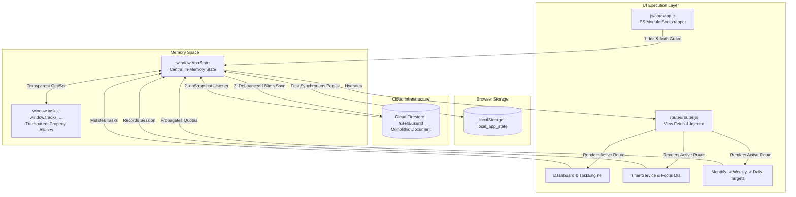

# X-29 ADVANCE — ARCHITECTURAL SPECIFICATION & SYSTEM DESIGN

> **Document Version:** 1.0.0  
> **Status:** Active / Permanent Architectural Baseline Reference  
> **Project Identity:** X-29 Advance  
> **Database:** Google Cloud Firestore (`x-2k-29`)

---

# PART I: CURRENT ARCHITECTURE (BASELINE AUDIT)

---

## 1. Directory Structure & File Map

The active codebase is structured as a hybrid Single Page Application (SPA) shell utilizing Vanilla JavaScript, DOM injection via fetch, inline global scripts, and Node.js developer tooling:

```text
d:\X-29 Project\X-29\X-29-code\
├── index.html                           # 294.7 KB / 3,891 lines: Monolithic application shell & 40 modals
├── login.html                           # 7.0 KB / 128 lines: Standalone authentication gateway
├── manifest.json                        # 714 B: Web App Manifest configuration
├── package.json                         # Node scripts and dependencies (firebase, firebase-admin)
├── vercel.json                          # Rewrites and clean URL configuration
├── firestore.rules                      # 11.4 KB: Production security rules enforcing /users/{userId}
├── firebase-service-account.json        # Admin credentials (used by backup/restore scripts)
│
├── api/
│   └── config.js                        # Vercel serverless function serving client Firebase credentials
│
├── css/
│   └── style.css                        # 10.9 KB / 425 lines: Core application design styles & animations
│
├── icons/                               # PWA icons and graphic assets (logo-sticker.png, x-29.jpeg)
│
├── pages/                               # Modular page fragments (HTML, CSS, JS loaded by Router)
│   ├── Analytics/                       # Analytics.html (64.2 KB), Analytics.css (5.9 KB), Analytics.js (5.5 KB)
│   ├── Daily Actions/                   # Daily Actions.{html, css, js} + monthly target setup/
│   │   └── monthly target setup/        # monthly target setup.js (194.2 KB), .html (42.5 KB), .css (4.1 KB)
│   ├── Daily Schedule/                  # Daily Schedule.{html, css, js}
│   ├── Dashboard/                       # Dashboard.html (58.1 KB), Dashboard.css (2.7 KB), Dashboard.js (4.5 KB)
│   ├── Exam Routine/                    # Exam Routine.{html, css, js}
│   ├── Focus/                           # Focus.js (86.8 KB), Focus.html (33.3 KB), Focus.css (13.9 KB)
│   ├── Master Config/                   # Master Config.{html, css, js}
│   ├── Outcome/                         # Outcome.{html, css, js}
│   ├── Pace Management/                 # Pace Management.{html, css, js}
│   ├── Polymath Orbit/                  # Empty placeholder directory
│   └── Subjects/                        # Subjects.js (87.1 KB), Subjects.html (5.9 KB), Subjects.css (2.3 KB)
│
├── js/
│   ├── dev-server.js                    # Local development server (HTTP static file server)
│   ├── firebase.js                      # 69.9 KB / 1,285 lines: Firestore sync, listeners, conflict resolution
│   ├── state.js                         # 53.6 KB / 1,166 lines: AppState definition, window aliases, storage
│   ├── utils.js                         # 25.3 KB: Legacy helper utilities
│   │
│   ├── core/                            # System bootstrapper and KPI engines
│   │   ├── app.js                       # 11.0 KB / 277 lines: Native ES Module bootstrapper & route guard
│   │   ├── metrics.js                   # 55.9 KB / 1,273 lines: KPI metrics calculation engine
│   │   ├── rollover.js                  # 13.4 KB: Daily midnight date rollover monitor
│   │   ├── scheduleSlot.js              # 241 B: Slot helper stub
│   │   └── state.js                     # 752 B: Module alias stub
│   │
│   ├── features/                        # Extracted domain modules
│   │   ├── analytics/                   # spectra.js (112.6 KB), chapterMap.js (56.1 KB), heatmap.js (46.3 KB)
│   │   ├── config/                      # masterConfig.js (43.8 KB), priorityConfig.js (40.1 KB), tracksConfig.js
│   │   ├── dashboard/                   # dashboard.js (102.8 KB / 2,058 lines): Dashboard UI & checklist cards
│   │   ├── exam/                        # examRoutine.js (68.4 KB), countdown.js (13.7 KB)
│   │   ├── habits/                      # dailyTracker.js (85.1 KB), dadbModal.js (20.8 KB)
│   │   ├── outcome/                     # outcomeResults.js (111.4 KB), outcomeCelebration.js (44.9 KB)
│   │   ├── pace/                        # paceManager.js (107.7 KB), paceEstimator.js (18.1 KB)
│   │   ├── schedule/                    # scheduleRoutine.js (49.6 KB), scheduleSlot.js (35.0 KB)
│   │   ├── targets/                     # monthlyTargets.js (282.0 KB), weeklyTargets.js (112.7 KB), dailyTargets.js
│   │   └── tasks/                       # taskEngine.js (94.9 KB / 1,749 lines), subjectGoals.js (46.7 KB)
│   │
│   ├── pages/login/login.js             # 6.2 KB: Login form validation and submit handling
│   ├── services/                        # auth.js (17.3 KB), backup.js (6.5 KB), taxonomy.js (6.1 KB)
│   ├── shared/                          # modals.js (14.5 KB), sidebar.js (3.8 KB), deletion.js, toast.js
│   └── utils/                           # colors.js (5.9 KB), date.js (8.9 KB), format.js, dom.js, storage.js
│
├── router/
│   └── router.js                        # 38.4 KB / 743 lines: Vanilla JS dynamic page fetcher & view router
│
├── shared/services/
│   └── timerService.js                  # 118.8 KB / 2,495 lines: Monolithic Focus timer & session logger
│
├── scripts/                             # Node.js CLI tools: backup.js, verify-backup.js, restore.js
├── tests/                               # 12 automated Node.js regression test suites
└── archive/fiscal-ledger/               # Decommissioned financial ledger feature
```

---

## 2. Current File Metrics & Largest Modules

The project contains **2,605.71 KB (2.54 MB)** of JavaScript across 25 primary runtime scripts, **52.20 KB** of CSS across 13 stylesheets, and **715.82 KB** of HTML across 14 template files.

### Top 15 Largest Files in Codebase (Excluding `node_modules`):

| File Path | Size | Lines | Primary Responsibility | Architectural Risk |
| :--- | :--- | :--- | :--- | :--- |
| `icons/logo-sticker.png` | 672.1 KB | Binary | Graphic asset used on login & splash | Network payload on mobile startup |
| `index.html` | 294.7 KB | 3,891 | Full SPA shell, 40 inline modal structures, CDN tags | Huge DOM tree; heavy memory consumption |
| `js/features/targets/monthlyTargets.js` | 282.0 KB | 5,348 | Monthly targets DB, auto-spread, batch allocator | Monolithic target calculations; tight DOM coupling |
| `pages/Daily Actions/monthly target setup/monthly target setup.js` | 194.2 KB | 3,766 | Setup UI, calendar spreads, target cards | Duplicate target logic with `monthlyTargets.js` |
| `archive/fiscal-ledger/fiscal-ledger.js` | 191.3 KB | 3,822 | Archived financial ledger module | Dead code retained in repository |
| `shared/services/timerService.js` | 118.8 KB | 2,495 | Background focus clock, alarms, logs, sessions | High CPU consumption; memory leak risk |
| `archive/fiscal-ledger/fiscal-ledger.html`| 117.9 KB | 1,778 | Archived financial ledger HTML | Dead markup |
| `js/features/targets/weeklyTargets.js` | 112.7 KB | 2,298 | Weekly targets database, ISO week calculations | Intertwined with monthly and daily targets |
| `js/features/analytics/spectra.js` | 112.6 KB | 2,166 | Spectra charts, burn-up curves, heatmaps | Heavy Chart.js instances; render blocking |
| `js/features/outcome/outcomeResults.js` | 111.4 KB | 2,059 | Outcome results, passing grades, celebration | Large inline HTML string generation |
| `js/features/pace/paceManager.js` | 107.7 KB | 2,110 | Pace estimation, subject rates, deadline candles | Recursive calculations with `metrics.js` |
| `js/features/dashboard/dashboard.js` | 102.8 KB | 2,058 | Dashboard checklists, KPI widgets, overview cards | Monolithic re-render cycles |
| `js/features/tasks/taskEngine.js` | 94.9 KB | 1,749 | Study plan generation, task toggling, date shifts | Central state mutation hub; circular triggers |
| `pages/Subjects/Subjects.js` | 87.1 KB | 1,740 | Subject progression UI, chapter badges, revision | Mixed DOM manipulation and syllabus data logic |
| `pages/Focus/Focus.js` | 86.8 KB | 1,712 | Chronograph UI, SVG clock hands, fullscreen controls| DOM re-renders on every clock tick |

---

## 3. Current Data Flow & State Architecture



### 3.1 State Organization (`js/state.js`)
* Central global store: `window.AppState` holding all application datasets (`tasks`, `tracks`, `customPrograms`, `monthlyTargetsDatabase`, `timerLogs`, `activeTimerState`, `dashboardConfig`, etc.).
* Backward Compatibility Bridge: 60+ transparent getter/setters registered on `window` aliasing `window[key]` to `AppState[key]`.
* Local Storage Sync: Fast synchronous serialization into `localStorage.getItem('local_app_state')` on every state mutation.

### 3.2 Cloud Synchronization Engine (`js/firebase.js`)
* **Monolithic Persistence Model:** The entire workspace is stored as a single document in Firestore at `/users/{userId}`.
* **Debounced Commits:** Mutations invoke `FirebaseService.notifyLocalMutation()`, batching changes across a 180ms debounce window before performing `set(docRef, payload, { merge: true })`.
* **Conflict Resolution & Array Merging:**
  * When a remote snapshot arrives while `AppState.isLocalDirty == true`, `window.reconcileArrays` merges local and remote lists using unique IDs (`generateItemId`) and tombstone records (`_tombstones`).
  * Self-echo writes are filtered by comparing incoming `_lastWriteId` against `_lastCommittedWriteId`.

### 3.3 Dynamic View Router (`router/router.js`)
* Internal SPA routing without URL updates or browser `pushState`.
* Dynamic Loading: `fetch()` retrieves page `.html`, `.css`, and `.js` fragments on-demand.
* In-Memory DOM Caching: Injects fetched HTML containers (`#page-*`) into `#page-container` and toggles `display: none` / `display: block` with slide-up CSS animations (`animate-page-enter`).
* Lifecycle Hooks: Coordinates `onMount()` and `onDestroy()` hooks across active page instances.

---

## 4. Current Dependencies & External Assets

* **Core Runtime:**
  * `firebase` (v12.17.1 / v12.19.0 Compat CDN): Client Auth and Firestore.
  * `firebase-admin` (v14.2.0): Used exclusively in Node.js backup/restore CLI scripts.
* **External CDNs (Render-Blocking):**
  * `https://cdn.tailwindcss.com`: In-browser JIT Tailwind compiler (executes in `<head>`, blocking FCP).
  * `https://cdn.jsdelivr.net/npm/chart.js`: Monolithic charting library loaded globally.
  * `https://fonts.googleapis.com`: Inter, Outfit, Plus Jakarta Sans, JetBrains Mono, Rajdhani, Chakra Petch.
  * `https://www.gstatic.com/firebasejs/12.19.0/*`: Firebase Compat runtime libraries.

---

## 5. Known Architectural Bottlenecks

1. **Massive Render-Blocking `<head>`:** 3 external CDN scripts (Tailwind JIT compiler, Chart.js, Firebase Compat) and 35 sequential local script tags block parsing of initial HTML.
2. **Monolithic DOM Weight:** `index.html` contains 3,891 lines and 40 modal dialogs parsed and kept in the live DOM tree simultaneously, regardless of whether they are ever opened.
3. **Single-Document Database Choke:** Writing even a single checkbox completion serializes the entire workspace (all tasks, tracks, syllabus items, timer logs) into a large JSON payload and sends it over the wire to Firestore.
4. **Unminified, Bundler-Less JavaScript:** 2.54 MB of unminified JavaScript loaded over dozens of individual HTTP requests without code splitting, tree-shaking, or modern compression.
5. **Absent PWA Service Worker:** `manifest.json` is configured, but `sw.js` is not implemented, preventing true offline asset caching.
6. **Circular Invocation Risks:** Inter-module dependencies between `taskEngine.js`, `metrics.js`, `dashboard.js`, and `paceManager.js` historically required reentrancy flags (`isUpdatingMetrics`, `isRenderingUI`) to avoid infinite recursion.

---

# PART II: TARGET ARCHITECTURE (MODERNIZATION PLAN)

---

## 6. Target Modernization Stack

```text
Target Architecture: Next.js 16 + React + TypeScript + Zustand + Firestore
```

* **Application Framework:** Next.js 16 (App Router) + React (Server Components by default, Client Components for interactivity).
* **Language:** TypeScript (strict mode, zero untyped `any` in core domains).
* **Styling Strategy:**
  * **Phase 1 (Preservation):** Existing `css/style.css` and modular page CSS preserved verbatim.
  * **Progressive Enhancement:** Zero-runtime Tailwind CSS compiled at build time (eliminating the 300KB+ client-side JIT CDN).
* **UI Primitives:** Radix UI (`@radix-ui/react-dialog`, `@radix-ui/react-dropdown-menu`, `@radix-ui/react-tabs`) for accessible, unstyled modal/dropdown primitives retaining exact X-29 CSS classes.
* **Icons:** Lucide React (`lucide-react`) replacing inline raw SVG strings where exact visual parity is preserved.
* **State Management:** Zustand stores (`useAppStore`, `useTimerStore`, `useTargetsStore`, `useAuthStore`) replacing `window.AppState` with granular selector subscriptions.
* **Data Access & Local-First:**
  * Firebase JS SDK v11 Modular API (`getDoc`, `setDoc`, `onSnapshot`) eliminating Compat layer overhead.
  * Local-First Offline Layer: IndexedDB backed by `idb` for multi-megabyte local caching, session logs, and offline queues.
* **PWA & Offline:** Serwist / Workbox Service Worker for precaching static app bundles and stale-while-revalidate data strategy.
* **Deployment:** Vercel with automatic Edge caching and Serverless API routes.

---

## 7. Clean Route & URL Architecture

The target Next.js application will adopt a unified single-domain structure with organizational Route Groups that **never** expose internal directory names in public URLs:

```text
Public Target URL             Next.js App Router Location
-------------------------------------------------------------------------
/                             app/(main)/dashboard/page.tsx
/dashboard                    app/(main)/dashboard/page.tsx
/analytics                    app/(main)/analytics/page.tsx
/focus                        app/(main)/focus/page.tsx
/daily-actions                app/(main)/daily-actions/page.tsx
/schedule                     app/(main)/schedule/page.tsx
/targets                      app/(main)/targets/page.tsx
/subjects                     app/(main)/subjects/page.tsx
/pace                         app/(main)/pace/page.tsx
/settings                     app/(main)/settings/page.tsx
/outcome                      app/(main)/outcome/page.tsx
/exam                         app/(main)/exam/page.tsx
/login                        app/(auth)/login/page.tsx
```

> [!IMPORTANT]
> Route groups `(main)` and `(auth)` provide clean separation of layouts (authenticated dashboard shell vs. standalone login page) without altering URL paths.

---

## 8. Target Directory Organization

```text
x-29-modern/
├── app/
│   ├── (auth)/
│   │   └── login/page.tsx               # Standalone login view
│   ├── (main)/
│   │   ├── layout.tsx                   # Persistent app shell (Sidebar, Header, Audio, Modals)
│   │   ├── page.tsx                     # Redirects to /dashboard
│   │   ├── dashboard/page.tsx
│   │   ├── analytics/page.tsx
│   │   ├── focus/page.tsx
│   │   ├── daily-actions/page.tsx
│   │   ├── schedule/page.tsx
│   │   ├── targets/page.tsx
│   │   ├── subjects/page.tsx
│   │   ├── pace/page.tsx
│   │   ├── settings/page.tsx
│   │   ├── outcome/page.tsx
│   │   └── exam/page.tsx
│   ├── api/
│   │   └── config/route.ts              # Firebase public config endpoint
│   ├── layout.tsx                       # Root HTML shell, font declarations, theme provider
│   └── globals.css                      # Compiled CSS tokens & imported styles
│
├── components/                          # Shared UI components
│   ├── ui/                              # Radix primitives styled with X-29 glass-card classes
│   ├── modals/                          # Modal dialogs mounted dynamically on demand
│   ├── navigation/                      # Sidebar, MobileHeader, Breadcrumbs
│   └── feedback/                        # Toast, Confetti, LoadingOverlay
│
├── features/                            # Domain-driven feature packages
│   ├── analytics/                       # Components, charts, heatmap logic, hooks
│   ├── auth/                            # AuthService, login form, route guards
│   ├── dashboard/                       # KPI cards, daily/weekly checklists, trend widgets
│   ├── exam/                            # Exam countdown, routines, session logs
│   ├── focus/                           # Chronograph SVG dial, timer engine, controls
│   ├── habits/                          # Daily actions, streaks, habit radar
│   ├── pace/                            # Pace calculator, burn-up rates, candle charts
│   ├── targets/                         # Monthly, weekly, daily target cascades & allocators
│   └── tasks/                           # Study plan generator, task engine, reordering
│
├── hooks/                               # Custom React hooks (useTimer, useRollover, usePWA)
├── stores/                              # Zustand state stores (appStore, timerStore, authStore)
├── services/                            # Firebase modular client, sync coordinator, audio
├── lib/                                 # Low-level utilities (colors, date, id, math)
├── types/                               # TypeScript domain schemas (AppState, Task, Track, Target)
├── public/                              # Static icons, manifest, service worker assets
└── docs/                                # Permanent AI project documentation
```

---

## 9. Client vs. Server Component Boundaries

* **Server Components (Default):** Static page layouts, metadata injection, static shell wrappers, initial configuration loading.
* **Client Components (`"use client"`):**
  * `FocusChronograph`: Real-time SVG rotation and millisecond clock updates.
  * `TaskItem` & `Checklist`: Interactive toggles with optimistic UI state.
  * `ChartRenderer`: Client-side dynamic Chart.js canvas lifecycle.
  * `ModalRoot`: Portal-mounted dialog presentation.
  * `AudioService` & `PWAInstaller`: Direct browser API interactions.
